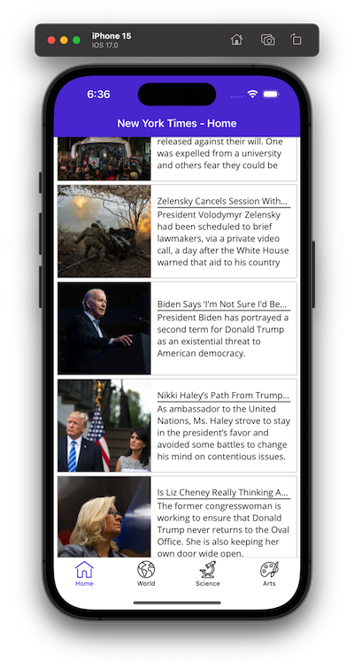

# .NET MAUI Slalom Workshop

This repository contains the code and artifacts for the .NET MAUI workshop, as well as instructions for each of the workshop's lessons.

In this workshop we'll be using the New Yor Times' Top Stories API. For more info please refer to: [Top Stories | Dev Portal (nytimes.com)](https://developer.nytimes.com/docs/top-stories-product/1/overview)

## Lesson 1

In this lesson we'll go over the basic of .NET MAUI application structure, installing the Visual Studio workload, creating and running a basic MAUI application in iOS and Android. We'll also get a glimpse of the final application that we're going to build together.

Below are the tasks we are going to work through in this lesson:

* Install the .NET MAUI workload in Visual Studio (Mac or Windows) including iOS simulators & Android emulators.
* Overview of final application we are building (screenshot below)

* Creating the sigle page application project and overview of the app' structure.
* Run the application in Android and iOS

## Lesson 2

* Create the list of articles with static data using DataGrid, CollectionView, ItemTemplate, etc.

## Lesson 3

* Introduction to MVVM. Loading data dynamically to the collection

## Lesson 4

* Implement Pull to refresh
* Create an article detail view. Navigate to a different page with article's details when clicking on an article in the list
* 